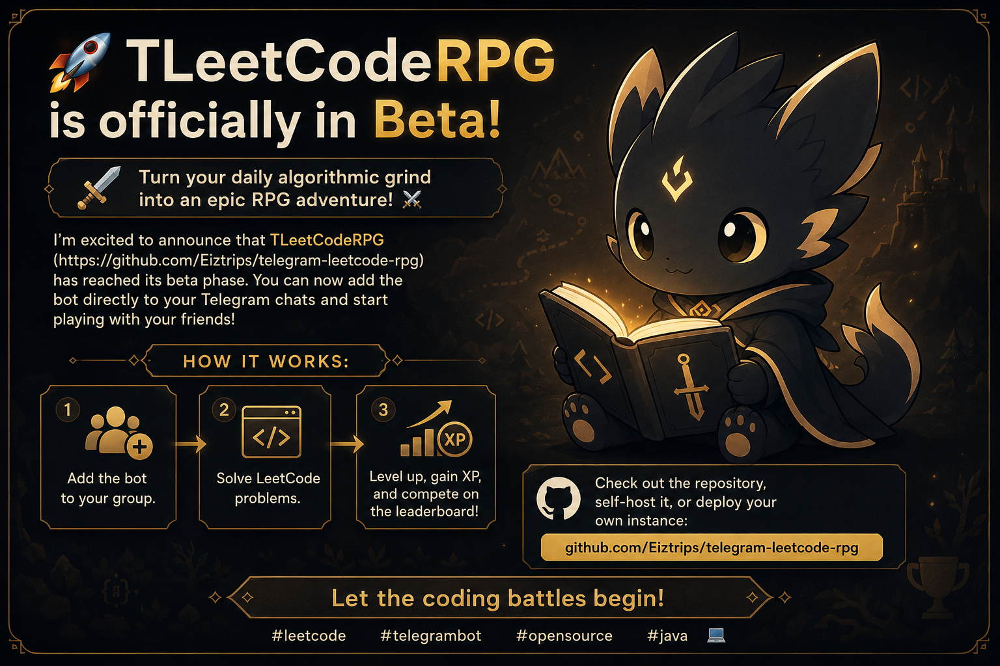

<div align="center">

# **Литквест** — LeetCode RPG

**Геймифицированный Telegram-бот для совместного решения задач LeetCode**

[](https://www.java.com)
[](https://gradle.org)
[](https://www.docker.com)
[](https://t.me/leetquestbot)

**Превращай скучное решение задач в настоящее RPG-приключение!** ⚔️

</div>

## Возможности

-  **Полноценная RPG-система** — уровни, опыт, достижения
-  **Мультиплеер** — добавляй бота в групповые чаты и решай задачи вместе с друзьями
-  **Лидерборды** — соревновайся с участниками чата
-  **Геймификация** — ежедневные квесты, награды и прогресс
-  **Статистика** — следи за своим ростом в алгоритмах
-  **Легкое подключение** — просто добавь бота в чат

## Быстрый старт

### Для пользователей

1. Перейди по ссылке: **[t.me/leetquestbot](https://t.me/leetquestbot)**
2. Нажми **"Start"**
3. Добавь бота в свой чат/группу
4. Начни решать задачи и получать опыт!

### Для разработчиков / self-host

```bash
# Клонируй репозиторий
git clone https://github.com/Eiztrips/telegram-leetcode-rpg.git
cd telegram-leetcode-rpg

# Скопируй .env.example в .env и заполни токены
cp .env.example .env

# Запуск через Docker Compose (рекомендуется)
docker compose up -d
```

## Технологии

- Backend: Java 25 + Spring Boot
- Архитектура: Hexagonal (Ports & Adapters) + Onion Architecture
- База данных: (указать, если есть)
- Сборка: Gradle
- Контейнеризация: Docker + Docker Compose
- Telegram API: Telegram Bot API

## Структура проекта

```
telegram-leetcode-rpg/
├── src/
│   └── main/java/...
├── .github/workflows/ 
├── assets/
├── .env.example
├── Dockerfile
├── compose.yaml
├── build.gradle.kts
└── ...
```

<div align="center">
Сделано с 😘 для leetcode ru комьюнити
</div>